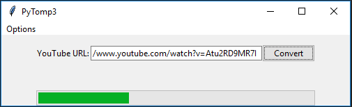
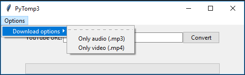

# PyToMp3
Extracts the sound (.mp3) from a Youtube video using [youtube-dl](https://rg3.github.io/youtube-dl/) Python module.

## Requirements

- Python >= 3.x
- Tkinter module (for GUI)
- youtube-dl module

## Installation

- Clone this repository
- Go to the root directory
- Install dependencies: <code>pip install -r requirements.txt</code>
- Run the application: <code>python main.py</code>

## Considerations

- For Windows and Linux platform is required FFmpeg libraries
- For Linux platform is require installed Tkinter module for Python 3
- It is recommended to have the pip package manager installed

## Screenshots

